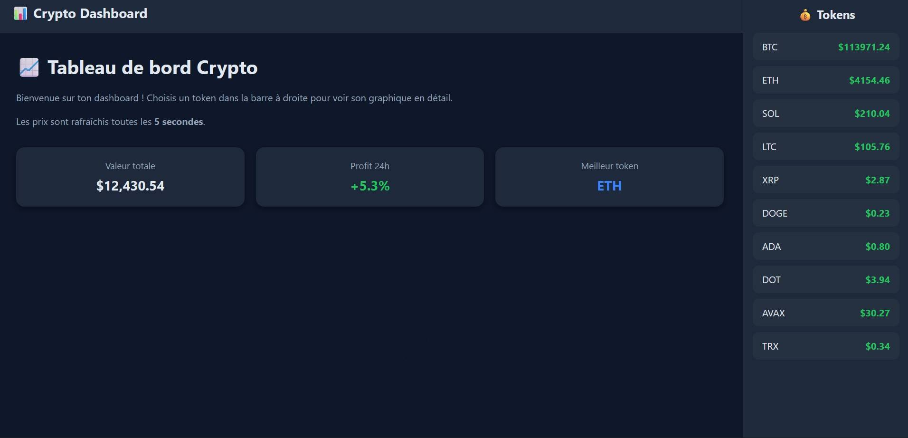
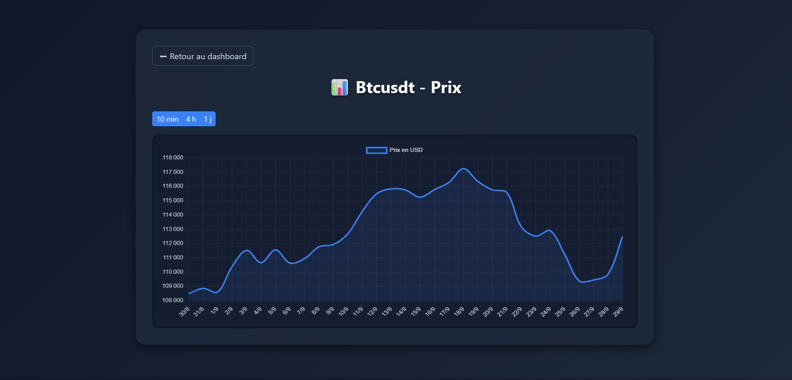

# 🪙 Crypto Dashboard

**Crypto Dashboard** est une application web interactive qui permet de suivre en temps réel les prix de vos crypto-monnaies préférées. L’interface inclut :

* Un **tableau de bord** avec tous les tokens et leurs prix mis à jour en direct
* Une **page graphique** par token avec l’évolution des prix sur différentes périodes (15 min, 4 h, 7 j)
* Une expérience responsive et moderne, avec **sidebar**, boutons et graphiques interactifs

---

## 💻 Capture d’écran


*Exemple de la page d’accueil avec sidebar et prix en direct.*


*Graphique interactif pour un token avec sélection de période.*

---

## ⚡ Fonctionnalités principales

* **Prix en temps réel** pour 10 tokens populaires via l’API Binance
* **Graphiques interactifs** pour chaque token avec Chart.js
* **Choix de période** : 15 min, 4 h, 7 j
* **Interface responsive** avec sidebar et navigation facile
* **Cache côté serveur** pour limiter les appels API et améliorer la performance

---

## 🛠️ Installation

1. **Cloner le projet**

```bash
git clone https://github.com/tonusername/crypto-dashboard.git
cd crypto-dashboard
```

2. **Créer un environnement Python**

```bash
python -m venv .venv
source .venv/bin/activate   # Linux/macOS
.venv\Scripts\activate      # Windows
```

3. **Installer les dépendances**

```bash
pip install -r requirements.txt
```

> Le fichier `requirements.txt` doit contenir au minimum :

```
Flask==3.1.3
requests
```

4. **Lancer l’application**

```bash
python app.py
```

5. **Accéder au dashboard**
   Ouvrir votre navigateur sur [http://127.0.0.1:5000](http://127.0.0.1:5000)

---

## 📁 Structure du projet

```
crypto-dashboard/
├─ app.py                  # Application Flask
├─ templates/
│  ├─ index.html           # Page d’accueil
│  └─ token.html           # Graphique par token
├─ static/
│  ├─ style.css            # Styles personnalisés
│  └─ (images, icônes...) # Captures ou icônes
├─ requirements.txt        # Dépendances Python
└─ README.md               # Ce fichier
```

---

## 🔧 Configuration

* Les tokens suivis sont définis dans `app.py` :

```python
TOKENS = [
    ("BTCUSDT", "BTC"),
    ("ETHUSDT", "ETH"),
    ("SOLUSDT", "SOL"),
    ...
]
```

* Pour ajouter ou retirer un token, il suffit de modifier ce tableau.
* Le serveur utilise un cache de 5 secondes pour limiter les appels API.

---

## 🚀 Utilisation

1. Accéder à la page d’accueil → voir tous les tokens et leurs prix
2. Cliquer sur un token → afficher le graphique interactif
3. Changer la période via les boutons → le graphique se met à jour instantanément
4. Les prix sont rafraîchis toutes les 2 secondes

---

## 🎨 Personnalisation

* **Styles CSS** : modifier `static/style.css`
* **Graphiques** : personnaliser Chart.js dans `token.html`
* **Sidebar** : ajouter ou retirer des tokens via Jinja dans `index.html`

---

## 📌 Remarques

* L’application est destinée à un usage **local/de développement**.
* Pour un déploiement en production, utiliser un **serveur WSGI** (Gunicorn, uWSGI…) et sécuriser le site.
* Les données proviennent de **Binance API** pour garantir la précision et la rapidité.
